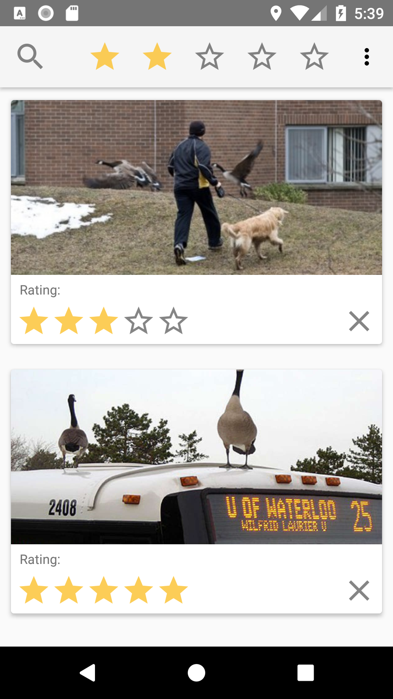

# CS 349 A4 - Mobile Development

## Description

An interactive mobile application that allows users to load images, and display these images in a dynamic layout that responds to device orientation. Users can rate images (1-5), and filter them based on this rating.

## List of functions

### Toolbar

- A star filtering system to filter the images based 0-5 rating
- Overflow Menu:
    - Clear filter: reset the filter to 0
    - Load images: load 10 local goose images
    - Delete image: remove all images from view

### Image Cards

- Each image card contains:
    - The image
    - A star rating system to rate the image based 0-5 rating
    - A clear button to reset the rating to 0
- Click the image to view in a new window (click again to dismiss)

### Orientation States

- Portrait:
    - A single vertical list of image cards
- Landscape:
    - A list of image cards with two columns
- All states are preserved when orientation changes:
    - Filter number
    - Images with their ratings
    - Filtered images
    - Scroll position

### Image formats

- Under `app/res/drawable`, `img_goose_1` is `png`, the rest of the images are `jpg`

## Development Environment

- Built with `Java` on `Android Studio 3.1.3`.
- Tested on AVD `PIXEL API 26`.
- Built on `macOS 10.13.6`.